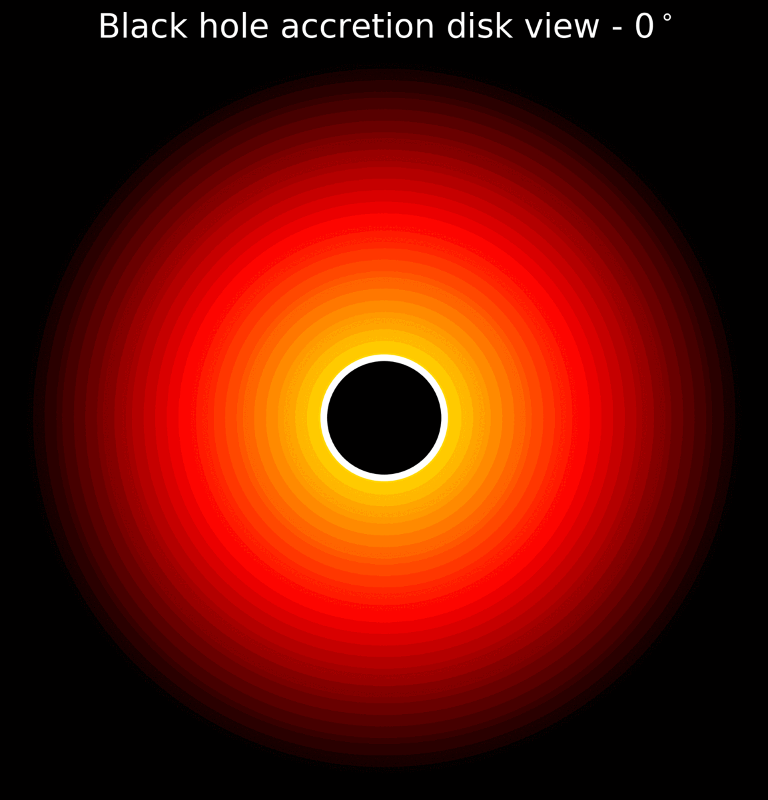
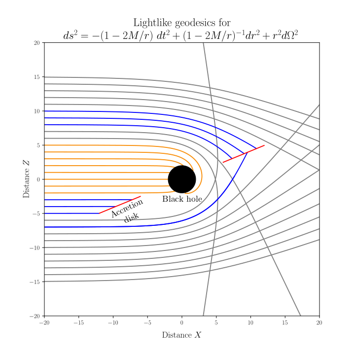

# 🕳️ Black Hole Photography Simulator


[](LICENSE)

<p align="center">
  
  <br><em>Simulated view of a Schwarzschild black hole with thin accretion disk</em>
</p>

---

## 📚 Table of Contents
- [🧠 Physics Background](#-physics-background)
- [🚀 Features](#-features)
- [🛠️ Installation](#-installation)
- [▶️ Usage](#-usage)
- [📁 Repository Structure](#-repository-structure)
- [📷 Example Results](#-example-results)
- [👨‍💻 Team](#-team)
- [📄 License](#-license)

---

## 🧠 Physics Background

This simulator computes photon trajectories in Schwarzschild spacetime, demonstrating:

- **Light bending** near the event horizon  
- **Photon sphere** at \( r = 3GM/c^2 \)  
- **Relativistic effects**:
  - Doppler beaming  
  - Gravitational redshift  
- **Thin accretion disk** physics (Novikov–Thorne model)

We solve the geodesic equations numerically:
```math
\frac{d^2x^\mu}{d\lambda^2} + \Gamma^\mu_{\alpha\beta}\frac{dx^\alpha}{d\lambda}\frac{dx^\beta}{d\lambda} = 0
```

For detailed theory and derivations, check the [📄 Theory documentation](docs/Theory.md).

---

## 🚀 Features

- Interactive **PyQt5** GUI  
- Real-time control of parameters:
  - Black hole mass
  - Viewing angle (0°–90°)
  - Disk temperature profile  
- Multiple visualization modes  
- Export simulation data and results  

---

## 🛠️ Installation

Clone the repository:

```bash
git clone https://github.com/RanierPhys/BlackHole_Photography.git
cd BlackHole_Photography
```

Install the required packages:

```bash
pip install matplotlib scipy pyqt5 numpy
```

If you're using Python 3 with `pip3`:

```bash
pip3 install matplotlib scipy pyqt5 numpy
```

---

## ▶️ Usage

Run the main script:

```bash
python codes/Black_hole_photography.py
```

The simulator will open an interactive GUI where you can tweak physical parameters and visualize photon trajectories and the resulting black hole image.

For detailed instructions, see [📘 Manual](docs/Manual.md).

---

## 📁 Repository Structure

```
BlackHole_Photography/
├── codes/                # Simulation source code
│   ├── Black_hole_photography.py
│   ├── Isoradiciais.ipynb
│   └── Isoradiciais_fantasma.ipynb
├── docs/                 # Documentation
│   ├── Manual.md
│   └── Theory.md
├── images/               # Output and UI images
│   ├── simulation_example.png
│   .
│   .
│   .
├── README.md             # This file
└── LICENSE               # MIT License
```

---

## 📷 Example Results

You can generate output images of light bending and shadow formation around black holes using various initial parameters.

<p align="center">
  
</p>

---

## 👨‍💻 Team

- **Ranier Menote**   
- **Igor Reis**  
- **Pedro Cintra**   
- **Felipe Fontinele**  
- **Vitor Dantas**  

This project was developed for the *McGill Physics Hackathon 2021*.

---

## 📄 License

This project is licensed under the MIT License. See the [LICENSE](LICENSE) file for details.
