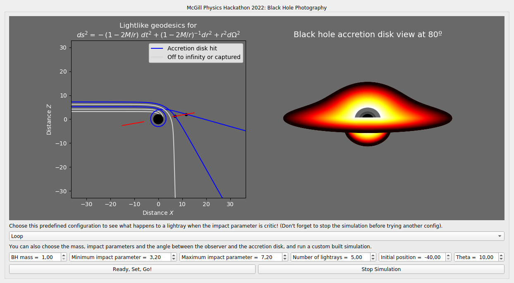

# Black Hole Photography Simulator


[](LICENSE)

<p align="center">
  
  <br><em>Simulated view of a Schwarzschild black hole with a thin accretion disk</em>
</p>

## Table of Contents
- [🌌 Physics Background](#-physics-background)
- [🚀 Features](#-features)
- [🛠️ Installation](#-installation)
- [💻 Usage](#-usage)
- [📖 Manual](#-manual)
- [📁 Repository Structure](#-repository-structure)
- [🖼️ Example Results](#-example-results)
- [👥 Team](#-team)
- [📜 License](#-license)

---

## 🌌 Physics Background

This simulator computes photon trajectories in Schwarzschild spacetime, demonstrating:

- **Light bending** near the event horizon  
- **Photon sphere** at *r = 3GM/c²*  
- **Relativistic effects**, including:
  - Doppler beaming  
  - Gravitational redshift  
- **Thin accretion disk** physics (Novikov–Thorne model)

The geodesic equations are solved numerically:

```math
\frac{d^2x^\mu}{d\lambda^2} + \Gamma^\mu_{\alpha\beta}\frac{dx^\alpha}{d\lambda}\frac{dx^\beta}{d\lambda} = 0
```

A more detailed derivation of the equations of motion, contours, fluxes and redshift effects is available in the [Theory](./docs/Theory.md) section.

---

## 🚀 Features

- Interactive **PyQt5** interface  
- Real-time control of simulation parameters:
  - Black hole mass  
  - Viewing angle (0°–90°)  
  - Disk temperature profile  
- Multiple visualization modes  
- Export simulation data (images, frames, etc.)

---

## 🛠️ Installation

### Prerequisites

To run the simulator, make sure you have Python 3.8+ and install the required packages:

```bash
pip install matplotlib scipy pyqt5 numpy
# or, if using python3 explicitly
pip3 install matplotlib scipy pyqt5 numpy
```

If you don't have pip installed, see [pip installation guide](https://pip.pypa.io/en/stable/installation/).

---

## 💻 Usage

Clone the repository:

```bash
git clone https://github.com/RanierPhys/BlackHole_Photography.git
cd BlackHole_Photography
```

Then launch the simulator:

```bash
python src/main.py
```

---

## 📖 Manual

We’ve built an intuitive interactive interface so you can focus on the physics:

- Select one of our **pre-configured initial conditions** or input your own parameters:
  - Black hole mass
  - Photon impact parameter
  - Observer coordinates and angle
- The simulation may take up to 30 seconds depending on your settings.
- You can stop at any time and test different configurations.
- The **main panel** shows both the geodesic trajectories and the final simulated image.

<p align="center">
  
</p>

---

## 📁 Repository Structure

```
BlackHole_Photography/
├── src/
│   ├── physics/          # Core calculations
│   │   ├── geodesics.py
│   │   └── disk_model.py
│   ├── ui/               # Interface code
│   │   ├── main_window.py
│   │   └── widgets.py
│   └── visualization/    # Plotting tools
├── data/                 # Simulation outputs
├── images/               # Example images
├── requirements.txt      # Dependencies
└── LICENSE
```

---

## 🖼️ Example Results

<p align="center">
  
</p>

---

## 👥 Team

- **Ranier Menote** – Physics modeling  
- **[Teammate 1]** – UI development  
- **[Teammate 2]** – Visualization  
- **Igor Reis**, **Pedro Cintra**, **Felipe Fontinele**, **Vitor Dantas** – Hackathon website and prototype  

Project developed for the McGill Physics Hackathon 2021.  
Website based on [Jekyll Now](https://github.com/barryclark/jekyll-now) (MIT License).

---

## 📜 License

This project is licensed under the [MIT License](LICENSE).
