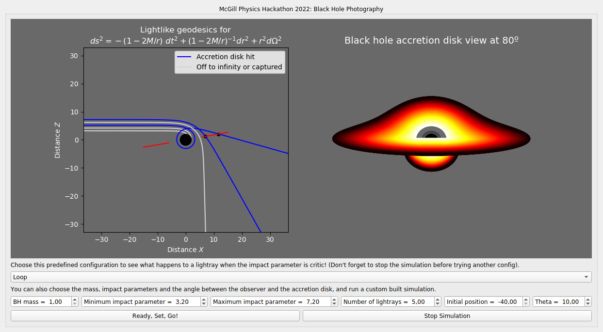

# 🧰 Simulator Manual

## Prerequisites

To run our simulator, you’ll need:

- Python 3.8 or higher
- The following Python packages:
  - `matplotlib`
  - `scipy`
  - `pyqt5`
  - `numpy`

Install them via:

```bash
pip install matplotlib scipy pyqt5 numpy
```

Or, if using `python3`:

```bash
pip3 install matplotlib scipy pyqt5 numpy
```

If you don’t have pip installed, refer to the [pip installation guide](https://pip.pypa.io/en/stable/installation/).

## Running the Simulator

Clone the GitHub repository:

```bash
git clone https://github.com/RanierPhys/BlackHole_Photography.git
cd BlackHole_Photography
```

Then, simply run:

```bash
python src/main.py
```

## Simulator Interface

We've created a single interactive window to simplify your experience.

You can:

- Choose **preconfigured settings** or **enter your own**:
  - Black hole mass
  - Photon impact parameter
  - Observer coordinates and viewing angle
- Watch the simulation evolve (up to ~30 seconds), or click **Stop** to try other configurations
- View:
  - Geodesic trajectories
  - Final simulated black hole photo

### UI Preview

<p align="center">
  
</p>
