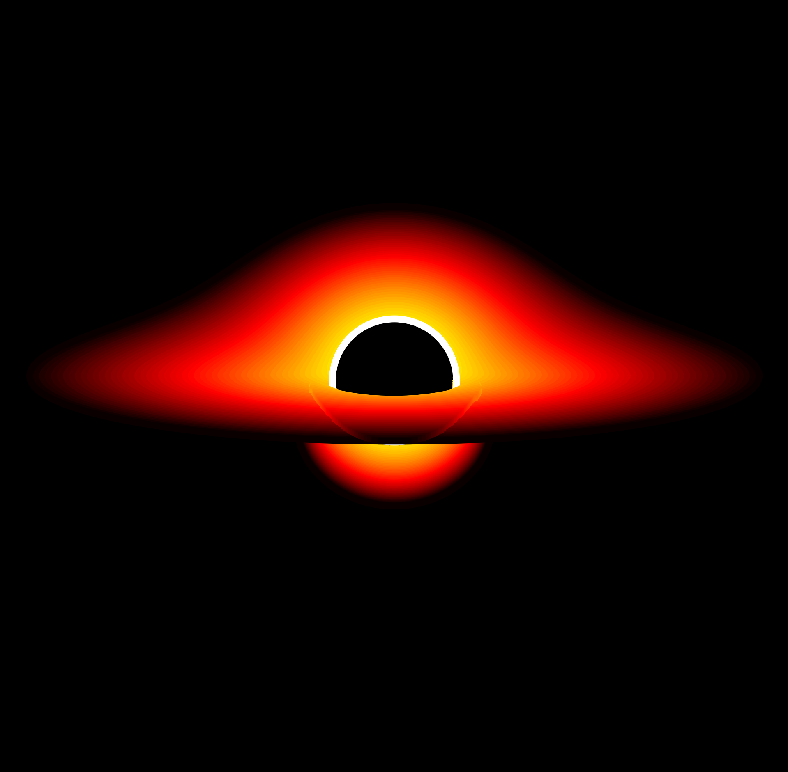

# 🧪 Theory Behind the Simulator

Black holes captivate scientists and the public alike. While their theoretical prediction dates back decades, it was only recently that we imaged one via the **Event Horizon Telescope**.

Our simulator aims to generate realistic black hole photographs, following work like [Luminet (1979)](https://ui.adsabs.harvard.edu/abs/1979A%26A....75..228L/abstract).

---

## Schwarzschild Metric

We simulate **Schwarzschild** (non-rotating) black holes using the metric:

```math
ds^2 = -\left(1 - \frac{2M}{r}\right) dt^2 + \left(1 - \frac{2M}{r}\right)^{-1} dr^2 + r^2 (d\theta^2 + \sin^2\theta d\phi^2)
```

---

## Photon Orbits

For photons (\(\theta = \pi/2\)) with impact parameter \(b\):

```math
\left(\frac{du}{d\phi}\right)^2 = 2Mu^3 - u^2 + \frac{1}{b^2}, \quad u = \frac{1}{r}
```

These yield the lightlike **geodesics** used to trace trajectories.

<p align="center">
  
</p>

---

## Accretion Disk Contours

We compute level curves using the parameterized relations between \(b\) and periastron \(P\):

```math
b = \frac{P^3}{P - 2M}, \quad Q^2 = (P - 2M)(P + 6M)
```

Using elliptical integrals:

```math
\frac{1}{r} = -\frac{Q - P + 2M}{4MP} + \frac{Q - P + 6M}{4MP} \cdot sn^2\left[\frac{\gamma}{2}\sqrt{\frac{Q}{P}} + F(\xi_\infty, k)\right]
```

<p align="center">
  
</p>

---

## Simulating the Photo

Using the **Novikov-Thorne** model ([Page & Thorne, 1974](https://ui.adsabs.harvard.edu/abs/1974ApJ...191..499P/abstract)):

### Emitted flux:

```math
F_s = \frac{3M\dot{M}}{8\pi} \cdot \frac{1}{(r^* - 3)r^{*5/2}} \left[\sqrt{r^*} - \sqrt{6} + \frac{\sqrt{3}}{3} \log \left(\frac{(\sqrt{r^*} + \sqrt{3})(\sqrt{6} - \sqrt{3})}{(\sqrt{r^*} - \sqrt{3})(\sqrt{6} + \sqrt{3})} \right)\right]
```

### Observed flux:

Due to redshift and relativistic beaming, the observer measures:

```math
F_s^{real} = \frac{F_s}{(1 + z)^4}
```

with redshift factor:

```math
1 + z = \left(1 - \frac{3M}{r}\right)^{-1/2} \left[1 + \left(\frac{M}{r^3}\right)^{1/2} b \sin(\theta) \sin(\alpha) \right]
```

Each photon is traced from its emission point in the disk to the observer, accounting for bending and energy shift, building up the final **black hole photograph** pixel by pixel.

---

📚 For more, explore our code or read the [original paper by Luminet (1979)](https://ui.adsabs.harvard.edu/abs/1979A%26A....75..228L/abstract).
